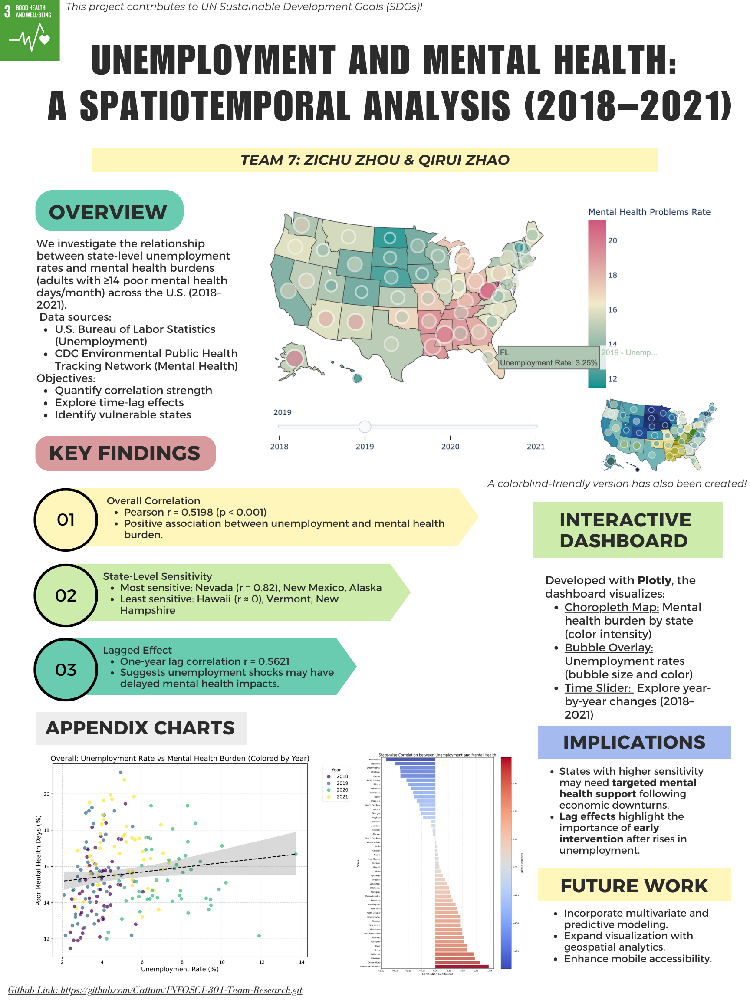

# Data Analysis Report: Unemployment and Mental Health Correlation

## 1. Overview
In this analysis, we examine the relationship between state-level unemployment rates and the prevalence of mental health burdens (measured as the percentage of adults experiencing poor mental health for at least 14 days in a month) across the United States between 2018 and 2021. Our primary aim is to:
- Quantify the strength of this relationship.
- Explore its temporal dynamics, especially potential lag effects.
- Identify states that may be particularly vulnerable.

The dataset integrates unemployment data from the U.S. Bureau of Labor Statistics with mental health indicators from the CDC’s Environmental Public Health Tracking Network.

The project was completed for the course INFOSCI 301 at Duke Kunshan University, instructed by Professor Luyao Zhang.

> Author: Zichu Zhou & Qirui Zhao  
> Date: April 28, 2025

## Poster Showcase

*The poster summarizes the research background, critique process, redesign strategies, and key visualization outcomes.*

## File Structure

### `Main/`
This folder contains the core components of the project and also includes the `Visualization/` and `metadata/` folders:

1. **Project Poster:**
   - A visual representation of the project, summarizing the key points and findings.

2. **Dashboard Code:**
   - Interactive visualization prototype that allows users to explore the data through various dashboards.

3. **Plot Codes:**
   - Includes the code for generating the three types of plots mentioned in the `Visualization/` folder: scatter plot, bar plot, and choropleth map.

4. **`Visualization/` Folder:**
   - Contains visual representations of the data:
     - **Dashboards:** `Delta`, `Sunsetdark`, and `Tealrose` dashboards with different color schemes, with the 'Delta' version specifically designed for colorblind users.
     - **Scatter Plots:** Plot comparing overall unemployment rate vs. mental health burden.
     - **Bar Plot:** State-wise correlation sensitivity ranking.
     - **Choropleth Map:** Geospatial distribution of correlation coefficients.

5. **`metadata/` Folder:**
   - Contains the cleaned data files used for analysis:
     - **Unemployment in America Per US State.csv:** Unemployment data by state.
     - **data_043155.csv:** Mental health indicators by state.
     - **partial_combined_data.csv:** Combined and cleaned data from both unemployment and mental health datasets.

## 2. Methodology
We conducted the following steps:

### Correlation Analysis:
- Computed Pearson correlation coefficients to measure the strength of association between unemployment rates and mental health burden, both overall and by state.

### Lag Analysis:
- Tested whether unemployment rates from the previous year predict increases in mental health burdens, simulating a possible delayed effect.

### State-Level Sensitivity:
- Identified states where the unemployment-mental health relationship is particularly strong or weak.

All analyses were conducted using Python libraries such as Pandas, SciPy, Matplotlib, and Seaborn.

## 3. Key Findings

### 3.1 Overall Correlation
- **Pearson Correlation Coefficient:** 0.5198  
- **p-value:** < 0.001  
This suggests that higher unemployment rates are associated with increased mental health burdens at the population level.

#### Visualization:
- A scatter plot with a regression line indicated a positive trend between unemployment and mental health burden, albeit with some dispersion, implying that other factors may also influence mental health outcomes.

### 3.2 State-Level Variation
The strength of the unemployment-mental health relationship varied significantly across states:

#### Strongest Positive Correlations (most sensitive states):
- **Nevada** (r = 0.82)
- **New Mexico** (r = 0.79)
- **Alaska** (r = 0.78)
- **West Virginia** (r = 0.76)

These states showed a strong link between unemployment changes and mental health distress.

#### Weakest or Negative Correlations (least sensitive states):
- **Hawaii** (r = -0.05)
- **Vermont** (r = 0.10)
- **New Hampshire** (r = 0.12)

In these states, mental health burdens appeared less directly connected to unemployment fluctuations, suggesting the presence of other mitigating factors (e.g., stronger social safety nets, community resilience).

### 3.3 Lagged Effect Analysis
When considering a one-year lag (i.e., comparing the previous year’s unemployment rate to the current year’s mental health burden):

- **Lagged Pearson Correlation Coefficient:** 0.5621  
- **p-value:** < 0.001  

The lagged relationship was slightly stronger than the contemporaneous one, suggesting that unemployment shocks may take time to fully manifest in population-level mental health statistics. This finding supports the hypothesis of a temporal lag effect between economic distress and psychological outcomes.

## 4. Preliminary Conclusions
- State-level unemployment is moderately associated with mental health burdens, supporting the premise that economic hardship influences population wellbeing.
- There is evidence of a time-lag effect, indicating that the full impact of rising unemployment on mental health may only become apparent after a delay.
- Certain states are particularly vulnerable to the mental health effects of unemployment, possibly due to economic structures, healthcare access, or cultural factors.

### Policy Implications:
- Targeted mental health support may be particularly critical in states with high sensitivity.
- Lag effects highlight the need for proactive intervention strategies following economic downturns, rather than reactive ones.

## 5. Limitations and Future Work
### Limitations:
- **Short Time Frame:** Data spans only 2018–2021. Longer historical windows would provide stronger statistical power.
- **Confounding Variables:** Factors like healthcare access, COVID-19 impacts, and state-level interventions were not controlled for.

### Further Analysis:
- Multivariate regression models controlling for additional socio-economic factors.
- Machine learning models (e.g., LASSO regression) for predictive analysis, as outlined in the proposal.
- Geospatial visualizations using choropleth maps to better illustrate regional differences.

## Summary Table

| Analysis                           | Result       |
|------------------------------------|--------------|
| Overall Correlation                | 0.5198       |
| Lagged Correlation (1 year)        | 0.5621       |
| Most Sensitive States             | Nevada, New Mexico, Alaska |
| Least Sensitive States            | Hawaii, Vermont, New Hampshire |

# Interactive Dashboard: Unemployment and Mental Health Visualization

## 1. Overview
To further illustrate the temporal and regional dynamics between unemployment and mental health burdens, we developed an interactive dashboard using **Plotly**. The dashboard integrates two layers of visualization:

- **Choropleth Map**: Displays state-by-state mental health problem rates (% of adults experiencing 14+ poor mental health days per month).
- **Bubble Overlay**: Represents unemployment rates, where bubble size and color intensity correspond to the unemployment severity.

A **time slider** allows users to interactively explore changes from 2018 to 2021, providing a comprehensive view of the relationship between unemployment and mental health burdens over time.

## 2. Dashboard Features

| Feature                          | Description (EN)                                                | 
|----------------------------------|-----------------------------------------------------------------|
| **Mental Health Visualization**  | Color intensity reflects mental health burden per state.        |
| **Unemployment Visualization**   | Bubble size and shade represent unemployment rates.            | 
| **Time Slider**                  | Interactive year-by-year comparison.                           | 
| **Tooltips**                     | Hovering over states/bubbles shows detailed data.               |

## 3. Accessibility Features
In addition to the standard visualizations, we have included colorblind-friendly alternatives for better accessibility. Using color palettes derived from colorblind-friendly schemes, users can choose from multiple visualization options, ensuring a better experience for all individuals, regardless of visual impairments.

### Available Visualizations:
- **Default View**: Standard color gradients for mental health and unemployment visualizations.
- **Colorblind-Friendly Options**: Alternative color palettes that cater to common color vision deficiencies (e.g., Deuteranopia, Protanopia).

These options can be toggled through the dashboard settings, providing a flexible viewing experience.

## 4. Purpose and Impact
This dashboard enhances user understanding of both spatial disparities and temporal trends, aligning with our project’s goal to deliver a rich, multi-dimensional perspective on economic and public health interactions. It helps users visually grasp the relationship between unemployment and mental health burdens across different states and years, while providing a more accessible experience through colorblind-friendly features.

## 5. Access and Usage
The interactive dashboard is available for public access. Users can:
- Explore state-level disparities and time-based trends between unemployment and mental health burdens.
- Adjust visualization settings to suit personal preferences, including toggling between standard and colorblind-friendly views.
- Interact with the time slider to view data changes year by year.

## 6. Future Work and Enhancements
- **Geospatial Analytics**: Incorporating more advanced geospatial analytics for deeper insights.
- **Predictive Modeling**: Adding features for predictive analytics based on the data.
- **Mobile Accessibility**: Ensuring the dashboard is fully accessible and responsive on mobile devices.

This dashboard serves as a powerful tool for understanding the intersection of economic and public health factors, empowering users to explore the data interactively while considering the needs of individuals with varying visual abilities.
